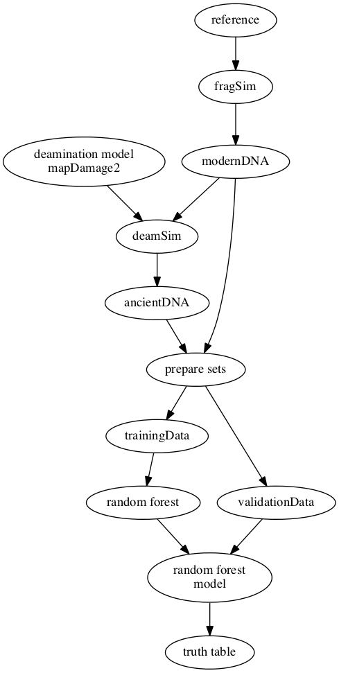

# Introduction

This readme is for the internship project. We will deposit all the information in this repository. 

# Folder hierarchy

- codes
- results
- dotfiles

# Overview of the project

Authentication of ancient DNA reads can be done using alignment based methods. However, it is not possible to align most of the aDNA sequences to reference genome. So, most of the aDNA sequences remain unauthenticated.

In this project, we would like to tackle this problem via usint the frequency difference of *k*-length nucleotide substrings (*k*-mers) between modern and ancient DNA sequences.

# Material and Methods

## Tools

### Gargammel

We will use this tool to simulate modern and ancient DNA sequences. It is possible to download this tool using this [site](https://grenaud.github.io/gargammet/).

### Mapdamage2

This [site](https://ginolhac.github.io/mapDamage/).

## Steps

