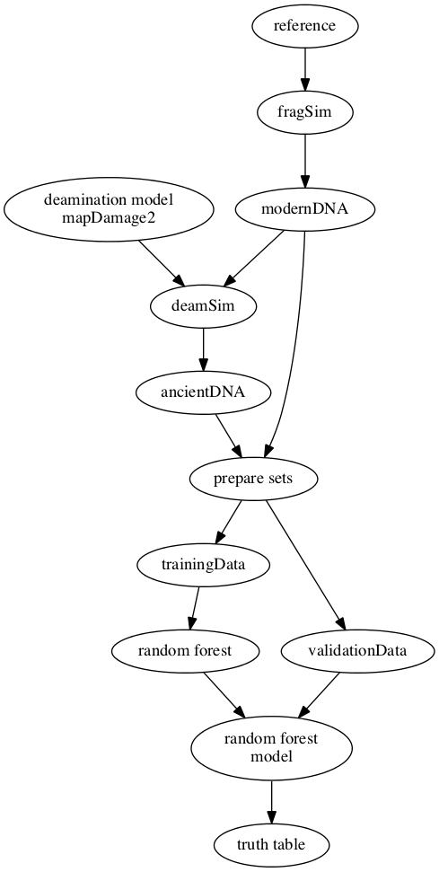

# Introduction

This readme is for the internship project. We will deposit all the information in this repository. 

# Folder hierarchy

This step is important. So we need to decided int the first place. Please place everything to their respective folders.  

We have a data folder but probably we will not push any data to github. If we can download data, then please write a script to download it. We will push data *only if* we have to.

+ data
    + if we can download data, then please 
+ codes
+ results
    + tables
    + plots
    + models
+ report
    + tables
    + figures
    + dotfiles
    + reference.bib
    + codes (to reproduce figures)

Let's follow these guideline.

# Overview of the project

Authentication of ancient DNA reads can be done using alignment based methods. However, it is not possible to align most of the aDNA sequences to reference genome. So, most of the aDNA sequences remain unauthenticated.

In this project, we would like to tackle this problem via usint the frequency difference of *k*-length nucleotide substrings (*k*-mers) between modern and ancient DNA sequences.



# Material and Methods

## Tools

### Gargammel

We will use this tool to simulate modern and ancient DNA sequences. It is possible to download this tool using this [site](https://grenaud.github.io/gargammet/).

### Mapdamage2

This [site](https://ginolhac.github.io/mapDamage/).

## Preparing the Environment

### Installation of Gargammel

Create and install the required environment for Gargammel:

```
conda env
conda create --name gargammel
conda activate gargammel
conda install -c bioconda gargammel

```
### Packages That We Need to Install in Order to Use Mapdamage2

Install the R packages required to be able to use Mapdamage2:

```
conda install r-inline
conda install r-gam
conda install r-Rcpp
conda install r-RcppGLS
conda install r-RcppGSL
conda install r-ggplot2

```
## Steps

Download reference genome:

```
conda activate gargammel
cd data/
sh download_reference_genome.sh
cd ..

```

Simulate modern DNA dataset:

```
samtools faidx data/GCF_000005845.2_ASM584v2_genomic.fna

fragSim -n 100000 -l 100 data/GCF_000005845.2_ASM584v2_genomic.fna  > data/modern.fasta   #creating DNA fragments of e.coli to be simulated by deamSim

```

Apply ancient DNA damage to simulated dataset:

``` 
deamSim -mapdamage ~/gargammel/examplesMapDamage/results_LaBrana/misincorporation.txt double data/modern.fasta > data/ancient.fasta

```

Confirm ancient DNA damage:

1. index reference genome
2. align DNA sequence to reference genome
3. use mapDamge2 to calculate deamination rates

``` 
bwa index data/GCF_000005845.2_ASM584v2_genomic.fna
bwa mem data/GCF_000005845.2_ASM584v2_genomic.fna data/ancient.fasta | samtools view -Sb > data/ancient.bam

samtools sort data/ancient.bam > data/ancient.sorted.bam

samtools index data/ancient.sorted.bam

mapDamage -i data/ancient.sorted.bam -r data/GCF_000005845.2_ASM584v2_genomic.fna


```

python3.8 k-mer.py –f modern.fasta –k 3 –o kmerthree.kmer  #using pyhton code to divide the DNA simulated by fragSim to k-mers of 3 


